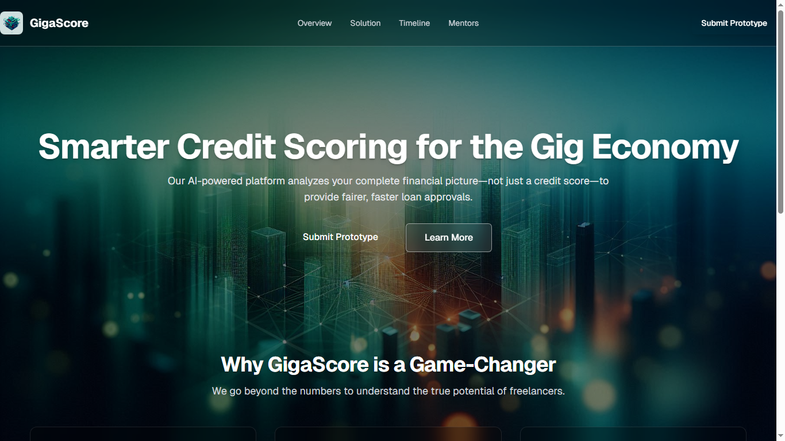
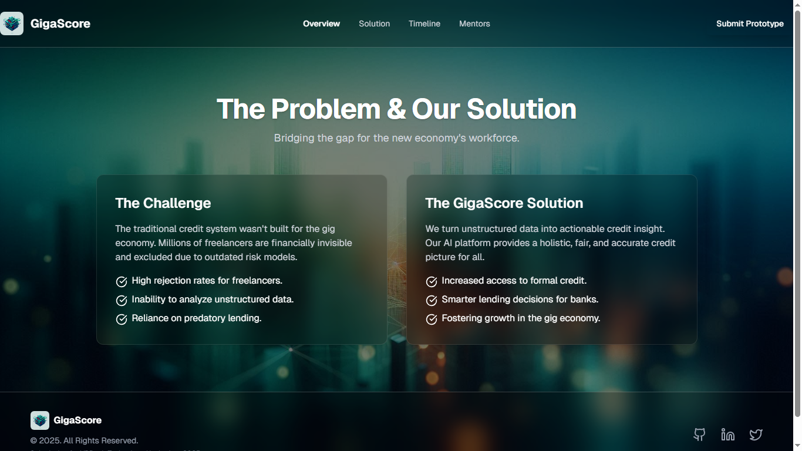
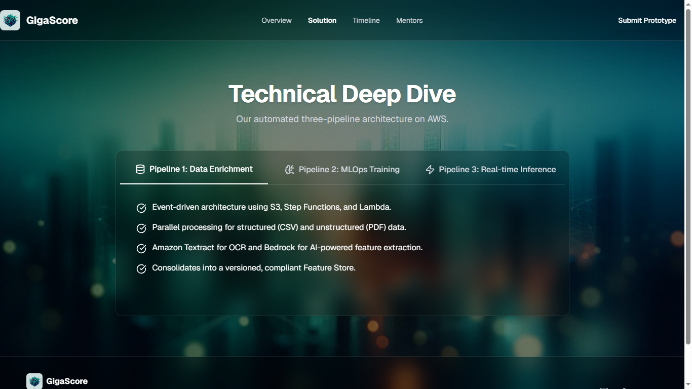
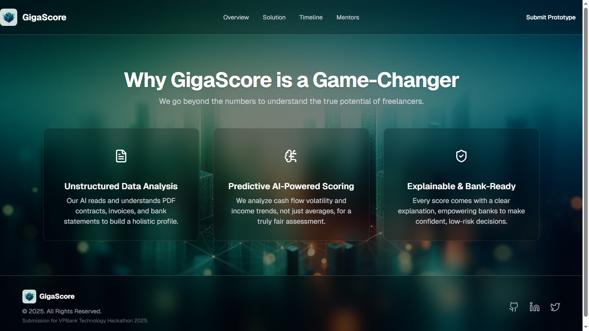

# GigaScore - AI-Powered Credit Scoring for the Gig Economy ✨


**GigaScore là dự án tham dự cuộc thi VPBank Technology Hackathon 2025, mang đến một giải pháp chấm điểm tín dụng đột phá, được thiết kế đặc biệt cho nền kinh tế tự do (Gig Economy) đang phát triển mạnh mẽ.**

[](https://www.typescriptlang.org/)
[](https://nextjs.org/)
[](https://tailwindcss.com/)
[](#)

---

## 🚀 Giới thiệu chung

Hệ thống tín dụng truyền thống đang thất bại trong việc phục vụ một phân khúc lao động ngày càng lớn: những người làm việc tự do, nhà thầu độc lập và nhân viên kinh tế chia sẻ. Họ bị từ chối cho vay, không thể mua nhà, và bị loại khỏi hệ thống tài chính chỉ vì không có một "bảng lương" truyền thống.

**GigaScore ra đời để giải quyết chính vấn đề này.**

> Chúng tôi không chỉ tạo ra một mô hình tín dụng tốt hơn. Chúng tôi đang xây dựng một cánh cửa tài chính công bằng hơn cho hàng triệu người lao động trong nền kinh tế mới.

## 📸 Giao diện dự án

| Trang chủ (Homepage) | Trang tổng quan (Overview) |
| :---: | :---: |
|  |  |
| **Giải pháp (Solution)** | **Tính năng (Features)** |
|  |  |

---

## 💡 Ý tưởng cốt lõi & Lợi ích

### Vấn đề nhức nhối (The Problem)

*   **Tài chính Bị loại trừ:** Freelancer bị đánh giá dựa trên các chỉ số lỗi thời, dẫn đến tỷ lệ bị từ chối cho vay cao.
*   **"Điểm mù" dữ liệu:** Các ngân hàng truyền thống "mù" trước dữ liệu phi cấu trúc như hợp đồng PDF, email công việc, hóa đơn - những tài liệu chứa đựng thông tin tín dụng quý giá.
*   **Rủi ro từ Tín dụng đen:** Khi bị từ chối bởi các kênh chính thức, người lao động tự do buộc phải tìm đến các nguồn vay không chính thức với lãi suất cắt cổ.

### Giải pháp của chúng tôi (Our Solution)

GigaScore là một nền tảng AI có khả năng **biến dữ liệu phi cấu trúc thành thông tin tín dụng có giá trị hành động**.

*   **Dành cho Freelancer & Gig Workers:**
    *   **Tăng cơ hội tiếp cận tín dụng:** Được đánh giá một cách công bằng dựa trên năng lực thực sự: sự ổn định của dòng tiền, độ tin cậy của hợp đồng đã thực hiện, và lịch sử chuyên môn.
    *   **Giảm sự phụ thuộc vào tín dụng đen:** Mở ra cánh cửa đến với các kênh tài chính chính thức, an toàn.
*   **Dành cho Xã hội & Ngân hàng:**
    *   **Thúc đẩy nền kinh tế Gig:** Cung cấp vốn cần thiết để thúc đẩy sự phát triển của một lĩnh vực kinh tế năng động.
    *   **Ra quyết định thông minh hơn:** Cung cấp cho ngân hàng một bức tranh tín dụng hoàn chỉnh và chính xác, cho phép họ tự tin mở rộng cơ sở khách hàng vào phân khúc mới này mà không làm tăng rủi ro một cách mù quáng.

---

## 🛠️ Kiến trúc & Công nghệ

Dự án được xây dựng trên kiến trúc 3-pipeline tự động hóa hoàn toàn trên nền tảng AWS.

#### 1. Pipeline 1: Data Enrichment (Làm giàu dữ liệu)
*   **Mục tiêu:** Tự động chuyển đổi dữ liệu thô (CSV, PDF, hình ảnh) thành Feature Store có cấu trúc.
*   **Công nghệ:** S3, Step Functions, Lambda, Amazon Textract (cho OCR) và **Amazon Bedrock** (sử dụng model Claude để hiểu và trích xuất thông tin từ văn bản).

#### 2. Pipeline 2: MLOps Training (Huấn luyện mô hình)
*   **Mục tiêu:** Tự động huấn luyện, đánh giá và đăng ký các mô hình Machine Learning hiệu suất cao.
*   **Công nghệ:** Amazon SageMaker, XGBoost, TabNet, với cơ chế đăng ký mô hình có điều kiện (ví dụ: AUC >= 0.85) và tập trung vào khả năng giải thích (XAI) bằng SHAP.

#### 3. Pipeline 3: Real-time Inference (Suy luận thời gian thực)
*   **Mục tiêu:** Cung cấp điểm tín dụng chính xác và có giải thích trong thời gian thực.
*   **Công nghệ:** API Gateway, SageMaker Serverless Inference (tối ưu chi phí, tự động co giãn về 0), và **Amazon Bedrock** để tạo ra các giải thích bằng ngôn ngữ tự nhiên.

### Ngăn xếp công nghệ (Tech Stack)

*   **Frontend:** Next.js, React, Tailwind CSS, Lucide React
*   **Backend & AI:** AWS (S3, Lambda, Step Functions, SageMaker, Bedrock)
*   **Deployment:** Render

---

## 🏁 Bắt đầu

Để chạy dự án này trên máy local của bạn, hãy làm theo các bước sau:

1.  **Clone the repository:**
    ```bash
    git clone https://github.com/Vanquoc0201/VPBankHackathon2025.git
    ```

2.  **Navigate to the project directory:**
    ```bash
    cd FE_VPBank
    ```

3.  **Install dependencies:**
    ```bash
    npm install
    ```

4.  **Run the development server:**
    ```bash
    npm run dev
    ```

    Mở [http://localhost:3000](http://localhost:3000) trên trình duyệt của bạn để xem kết quả.


Cảm ơn đã xem qua dự án của chúng tôi!
